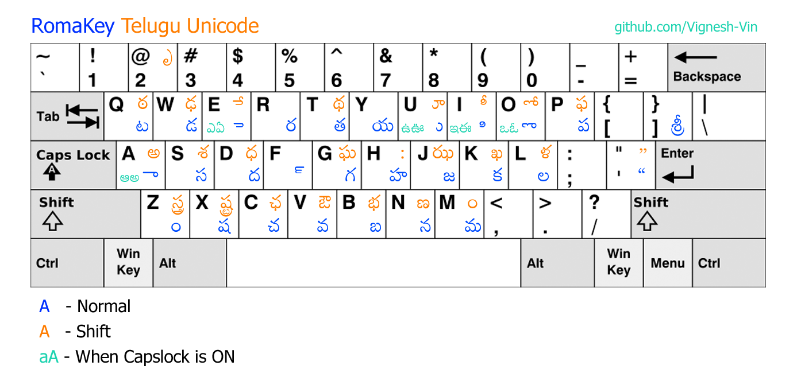

# RomaKey-Telugu-Unicode
Romic Keyboard for Unicode Typing in Telugu

This is a small program for unicode telugu typing on Windows PCs without needing Anu Script or Google Input Tools
RomaKey is based on Romic Keyboard layout from Anu Script Manager.
But this is faster, simpler, and uses less resources.

# Installation
No installation. Just download and double-click .exe file !!!
# Keyboard Layout
Here's the keyboard layout of this program.

# How to Use
1. RomaKey has no GUI.
2. Double-click .exe file to start RomaKey to type in telugu.
3. An icon will appear in system tray.
4. Press F11 key to pause RomaKey momentarily.
5. Press F11 again to resume RomaKey.
6. Just right-click system tray icon and click exit to close the program.

Note : You can also download additional Telugu Unicode Fonts and use them

# Contribtution
Responses be late.

Note: If you are editing the source code, use only AutoHotKey 1.1.30.02 because it's not working correctly with newer versions.
